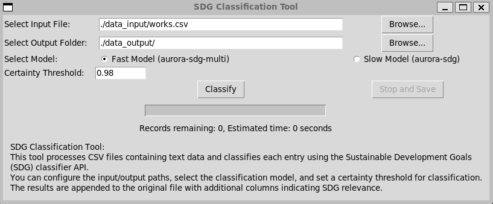

# SDG Classification Tools

## Description
The `sdg-classification-tools` script is designed to process CSV files containing text data, specifically in the 'Abstract' column, and classify each entry using the Sustainable Development Goals (SDG) classifier API. The script allows for configuration of various parameters such as the classifier model, SDG threshold, and input/output file paths, making it versatile for different datasets and use cases.

## TL;DR
The script reads text data from a CSV file, classifies it using the SDG classifier API, and appends the results to the file, exporting it with a new name indicating the process completion date and time.

## Prerequisites
Before you begin, ensure you have met the following requirements:
- Python 3.x installed on your system
- Access to command-line/terminal
- Internet connection for API access and package installation

## Installation
To install `sdg-classification`, follow these steps:

1. Clone the repository:
    ```bash
    git clone https://github.com/ubvu/sdg-classification-tools.git
    cd sdg-classification-tools
    ```

2. Create a virtual environment (optional but recommended):
    ```bash
    python -m venv env
    ```

3. Activate the virtual environment:
   - On Windows:
     ```bash
     env\Scripts\activate
     ```
   - On macOS and Linux:
     ```bash
     source env/bin/activate
     ```

4. Install the required packages:
    ```bash
    pip install -r requirements.txt
    ```

## Configuration
Configure the script by editing the `config.yaml` file. Set the following parameters:
- `data_input_folder`: Directory containing the input CSV file.
- `data_input_file`: Name of the input CSV file.
- `data_output_folder`: Directory where the output file will be saved.
- `sdg_threshold`: Threshold for SDG classification.
- `classifier_url`: URL of the SDG classifier API. Use `"https://aurora-sdg.labs.vu.nl/classifier/classify/aurora-sdg-multi"` for the fast model or `"https://aurora-sdg.labs.vu.nl/classifier/classify/aurora-sdg"` for the slower, more accurate model.

Example `config.yaml`:
```yaml
data_input_folder: /path/to/input/
data_input_file: input.csv
data_output_folder: /path/to/output/
sdg_threshold: 0.98
classifier_url: "https://aurora-sdg.labs.vu.nl/classifier/classify/aurora-sdg-multi"
```

## Running the Script
To run `sdg-classification`, execute the following command in your terminal:

```bash
python sdg_csv.py
```

## Graphical User Interface (GUI)
In addition to the command-line functionality, `sdg-classification-tools` now includes a graphical user interface (GUI), making it more accessible and user-friendly. The GUI allows users to easily configure and run the classification process without the need for command-line interactions.

### Features of the GUI:
- **File Selection**: Browse and select the input CSV file and the output folder directly through the interface.
- **Model Selection**: Choose between the fast and slow SDG classification models.
- **Certainty Threshold**: Set the certainty threshold for classification via an input box.
- **Progress Tracking**: View the progress of the classification process with an integrated progress bar.
- **Easy Execution**: Start the classification process with a simple click on the 'Classify' button.

### How to Use the GUI:
1. Run `sdg_gui.py` script to launch the interface.
2. Select the input file and output folder using the 'Browse' buttons.
3. Choose the desired classification model.
4. Set the certainty threshold for SDG classification.
5. Click 'Classify' to start the process.
6. Monitor the progress on the progress bar.

### Screenshot:


### Requirements:
- Ensure all dependencies are installed as mentioned in the installation section.
- Python's Tkinter library is used for the GUI, which is typically included in standard Python installations.


## Result Preview

### Output of the Script
After running the `sdg-classification-tools` script, the output is a CSV file with additional columns containing the classification results. The script appends several columns to the original data, providing detailed insights into the SDG classifications based on the text data in the 'Abstract' column.

### Added Columns Include:
- **SDG scores for each of the 17 goals**: Reflecting the relevance of each entry to the respective SDGs.
- **SDG Threshold Certainty**: A column indicating which SDGs meet the set threshold certainty.
- **Top 3 SDGs**: The three highest-scoring SDGs for each entry.
- **Average and 90th Percentile Scores**: Offering an overview of the distribution of SDG relevance scores.
- **SDGs Above Average and 90th Percentile**: Highlighting the SDGs that score above the average and 90th percentile respectively.
- **Classifier Model Used**: Indicating which classifier model was used for the analysis.

### Sample Output File
For a practical example of the script's output, refer to the sample file provided in the repository:
- [Sample Output File](./data_output/works_sdg_20231201_132455.csv)

This sample file demonstrates the enriched dataset post-classification, showcasing how the script can be utilized for data analysis and research purposes in the context of Sustainable Development Goals.

---

Feel free to contribute to the development of this project by submitting pull requests or opening issues for any bugs or feature requests.